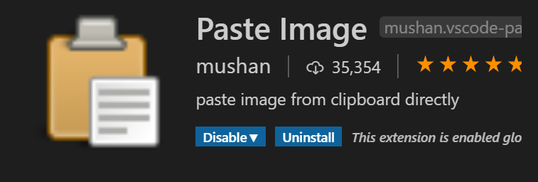

[마크다운에 drag and drop으로 이미지첨부하는 방식](https://marketplace.visualstudio.com/items?itemName=mushan.vscode-paste-image)을 알았다.

그건 바로 paste-image라는 확장팩. Vscode로 코딩을 한다면, Markdown 사용시 손 쉽게 
이미지를 첨부할 수 있다.
기특한 것! 😍 원하는 부분을 `shift + window key + s`로 선택한 뒤
`ctrl + alt + v`를 누르면 쉽게 불러낼 수 있다.

생각해봐야할 점은, 해당 이미지가 클라우드가 아닌, 현재 마크다운 파일과 함께하는 폴더와 존재하게 된다는 점.

