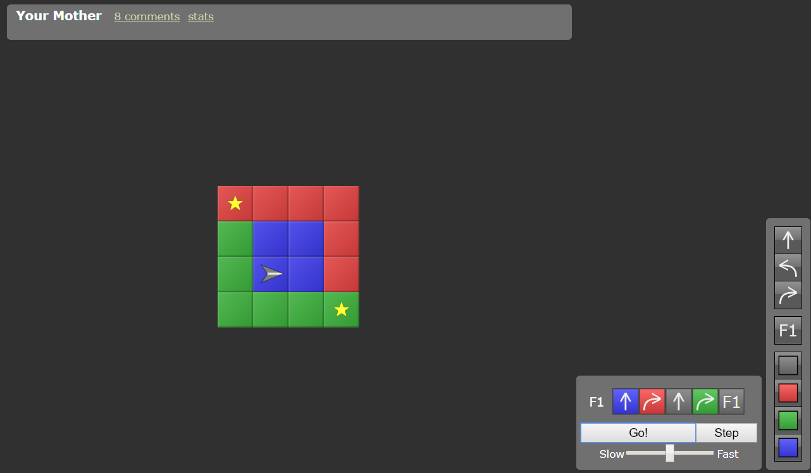
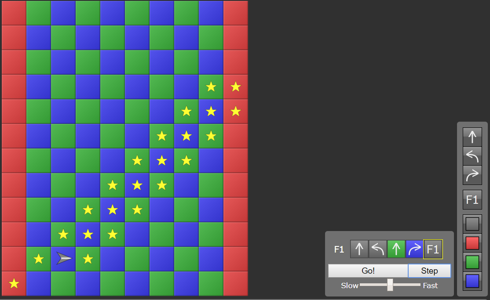
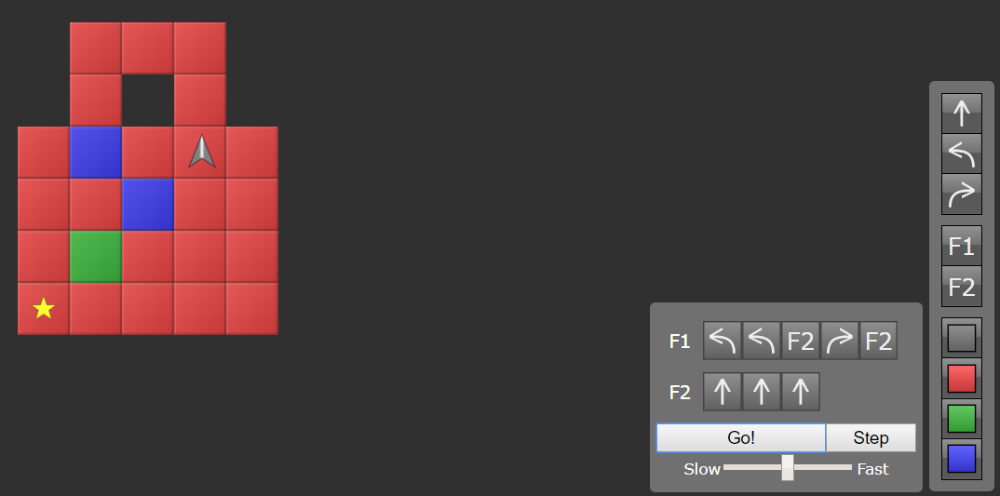

## 42Seoul 준비

간단하지만 복잡해보였던 퍼즐.
생각보다 재미있었다.
하다보면 된다는게 신기하다.
나도 모르게

[Your Mother](http://www.robozzle.com/beta/index.html?puzzle=3081&program=O1PrCqaaa) 

당신의 어머니라는 퍼즐.
~~니 엄마~~와도 같은 상스러운 말이 될 수 있으나...
( 왜 이런 식으로 이름을 지은거지???;;; )

이게 될까 싶었는데 되네

[Tepanny Tower](http://www.robozzle.com/beta/index.html?puzzle=3474&program=OfbzEqaaa)

이것도 복잡했는데 재밌게 잘 나왔다. 다행이다.

[PadLock](http://www.robozzle.com/beta/index.html?puzzle=2040&program=OfcbddMHqiaa)

[zigzag yoyo](http://www.robozzle.com/beta/index.html?puzzle=11071&program=OerfdeeXfbmaa)

이것도 새로운 유형이었다.
빨간 발판을 만날 때마다 funcion을 바꿔주는게 팁.
헷갈릴 땐 속도를 낮추고, 천천히 한단계씩 step으로 살펴보면 어떤식으로 해야할지 답이 나오는 듯.
가끔 답답한건, 천천히 바꿔봐도 어떻게 내가 원하는 방향으로 움직이게 만들지
머릿속에 떠오르지 않는다는 것...
약간 당황스러움;;;😂

